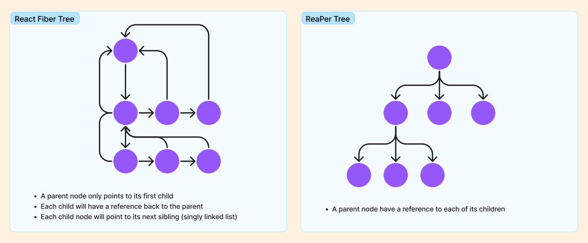

<h1 align="center" style="display: block; font-size: 2.5em; font-weight: bold; margin-block-start: 1em; margin-block-end: 1em;">

<a name="logo" href=""></a>
  <br /><br /><strong>ReaPer</strong>
</h1>

[](https://github.com/oslabs-beta/ReaPer/releases/tag/v1.0.0)
[](https://github.com/oslabs-beta/ReaPer/stargazers)
[](https://github.com/oslabs-beta/ReaPer/network/members)
[](https://github.com/oslabs-beta/ReaPer/watchers)
<br /><br />

---

<p align="center" style="display: block; font-size: 1.5em; font-weight: bold; margin-block-start: 1em">
Quick Links
  <br /><br />
</p>
<p align="center" style="font-size: 1em">
<a name="" href="">Website</a>
<a name="" href="">Medium</a>
<a name="" href="">Product Hunt</a>
</p>
<br /><br />

---

## What is ReaPer?
**ReaPer** is an open-source developer tool used for analyzing the performance of user interface and single-page applications based on the React frontend library. ReaPer offers comprehensive insights into React application efficiency in development. React is often used for building complex user interfaces that require a high degree of interactivity and responsiveness. It is important to know where performance weaknesses and strengths are to deliver optimal user experience. ReaPer brings a set of tools to improve the developer's diagnostic process. It creates a graphical analysis of component render events, their duration and their rank by render time. ReaPer starts a session and records render event data to demonstrate how the virtual DOM and each component's props and state change over time. The platform also presents a visual spread of the virtual DOM that can be traversed.

---

## [Table of Contents](#table-of-contents)
- [Motivation](#motivation)
- [Key Features](#key-features)
- [How to Use ReaPer](#how-to-use-reaper)
  - [Intallation](#installation)
  - [Manual Installation](#manual-install)
- [How ReaPer Works Under the Hood](#how-reaper-works)
  - [React Under the Hood](#react)
  - [React Fiber](#react-fiber)
  - [ReaPer Accesses React Fiber](#reaper-fiber)
  - [ReaPer's Magic](#reapers-magic)
  - [How the Tree Node Was Reconstructed](#tree-node)
- [How We Built Dev Tools](#dev-tools)
- [Call to Action](#call-to-action)
- [Resources](#resources)
- [Love the Product?](#share)
- [Contributors](#contributors)
- [License](#license)

---

## [Motivation](#motivation)

There are several strategies developers can leverage to improve the performance of their React applications, but it can be challenging to measurably assess the impact on performance resulting from these changes. React Dev Tool was the first inspiration for this product and a catalyst for further probing questions. While it is possible to determine which specific props and state have triggered a render event using React Dev Tools Profiler and Components, our engineers wondered if it would be possible to visualize how the virtual DOM and each component's props and state change over time with the render analysis on a single panel for a seamless workflow.

<div align="right">[ <a href="#table-of-contents">↑ to top ↑</a> ]</div>

---

## [Key Features](#key-features)

ReaPer allows developers to start and end a session to record render event data so that it can provide a visualization that details render times and information on how the virtual DOM and each component's performance changes during a session.

(Start recording session visual)

ReaPer's dashboard then displays four sets of data to analyze the render events.

(Visual for entire dashboard)


Developers have a bar graph of render events and event durations. 

(Visual of graph populating)


There is another graph of components ranked by their render time to see which costs the most to least time to render. 

(Visual of graph populating)


** THIS MAY CHANGED BASED ON FRONT END [The last graph is a line graph of each component extracted to display and compare their individual render times.]

(Visual of graph populating)

By traversing the React Fiber tree, a visual of the React virtual DOM is created and displayed, allowing developers to see how the virtual DOM and components’ state and props change over time. 

(Visual of DOM tree)

<div align="right">[ <a href="#table-of-contents">↑ to top ↑</a> ]</div>

---

## [How to Use ReaPer](#how-to-use-reaper)

#### [Installation](#installation)
To get started, install the ReaPer extension from the Chrome Web Store. 

**Note**: If you do not already have React Developer Tools [extension](https://chrome.google.com/webstore/detail/react-developer-tools/fmkadmapgofadopljbjfkapdkoienihi?hl=en) installed on your browser, it is required in order for ReaPer to run.

#### [Manual Installation](#manual-installation)
For a manual installation, clone the ReaPer repo onto your local machine after downloading React Dev Tools Chrome extension. 

```
git clone https://github.com/oslabs-beta/ReaPer.git
```

Install dependencies and run the ReaPer application locally. 
```
cd reaper
npm install
npm start
```

Add ReaPer to your Chrome extensions.

- Navigate to chrome://extensions
- Select Load Unpacked
- Turn on 'Allow access to file URLs' in extension details
- Choose reaper/dist
- Navigate to your application in development mode

**Note**: ReaPer is intended for analyzing and debugging React applications __in development mode__ running on __local host__, and **not** for production websites or production versions with minimized and compressed files.

**Note**: This version of ReaPer currently only supports __class components__. 

Open up your project in Google Chrome. 

Open Chrome Dev Tools:
- Windows / Linux: `F12`
- Mac: `Fn + F12`

Navigate to the ReaPer panel. Start recording a session, interact with your application, stop recording session and analyze your application's React performance on ReaPer's dashboard!

<div align="right">[ <a href="#table-of-contents">↑ to top ↑</a> ]</div>

---

## [How ReaPer Works Under the Hood](#how-reaper-works)

#### [React Under the Hood](#react)

In order for our engineers to begin to consider assessing a React application's performance, we needed a good understanding of how React works under the hood. React provides a component-based architecture that lets developers build reusable user interfaces (UI) components that can be composed together to create complex UIs. React also uses a virtual Document Object Model (DOM) that allows efficient updates to the UI by only re-rendering the components that changed. 

#### [React Fiber](#react-fiber)

When we took a deep dive into React, we learned of a powerful ingredient in React's core algorithm - React Fiber. React Fiber was introduced with the release of React 16, which was a significant update to the library. React Fiber makes the rendering of components more efficient by breaking the rendering process into smaller blocks that can be prioritized and executed more efficiently. It is based on a reconciliation algorithm that uses priorities, determines how state changes of components are propagated to its children and renders components based on importance and available resources. 

React builds a Fiber Node object that represents a unit of work in the React Fiber reconciliation algorithm. React Fiber Nodes are constructed into a tree structure with each node representing a single component in the application. Each node holds details about a component, its props, its children and metadata about its position in the rendering tree. 

#### [ReaPer Accesses React Fiber](#reaper-fiber)

ReaPer peeks into the reconciliations of each constructed tree and updated information after the reconciliation process. ReaPer pulls data on the render events, the trees and the components and how they've changed through the course of the session that was recorded. 

In order to gain access to React's Fiber Tree, ReaPer uses a React Dev Tool object called `__REACT_DEVTOOLS_GLOBAL_HOOK__`, which is installed onto the window object, and this is why developers need to have React Dev Tools installed onto their Chrome browser. ReaPer uses this "global hook" to access the contents of React's Fiber Tree including the method, onCommitFiberRoot, which is invoked after the reconciliation process is completed.

#### [ReaPer's Magic](#reapers-magic)

When a ReaPer session is initiated, ReaPer's magical functionality is injected into the developer's target testing application for monitoring React render data. ReaPer connects to React Dev Tool's global hook and then intercepts the global hook's onCommitFiberRoot method, instantiates a session's collection of render events, and after each render event, rebuilds ReaPer's own version of the tree for each event. Reconstructing the tree and determining which information to pull from React's tree was quite tricky. You'll see more about this in the next section.

Then when a session ends ReaPer turns the session off, undoes the interception of React global hook's onCommitFiberRoot method and points it back to the original method. Then the data is passed to the frontend to display on ReaPer's dashboard.

#### [How the Tree Node Was Reconstructed](#tree-node)
React's tree of fiber nodes is structured as a linked list of parent nodes with a 'child' property pointing to the first child node. The first child node points to other children in its 'sibling' property. This results in all of the children of one parent node being in their own linked list. 

When a render event is saved in a session, ReaPer recursively traverses React's fiber node tree of linked lists and creates a ReaPer tree that represents the virtual DOM after that render event. A ReaPer tree structure consists of tree node objects that save each fiber node's props, state, render time, component name, and an array of children nodes. This architecture facilitated the conversion of the ReaPer tree into a visual tree of components. 



<div align="right">[ <a href="#table-of-contents">↑ to top ↑</a> ]</div>

---

## [How We Built Dev Tools](#dev-tools)
ReaPer uses the [Chrome Devtools Panels API](https://developer.chrome.com/docs/extensions/reference/devtools_panels/) to integrate itself into the Google Chrome Dev Tools window. 

From there, the components of ReaPer can be broken down as follows:
- ReaPer front end, which comprises of React components and their business logic
- ReaPer back end, which is where the logic is for tasks like connecting to the `__REACT_DEVTOOLS_GLOBAL_HOOK__` parsing the React Fiber Tree and building the ReaPer tree, and connecting to the user’s target React application
- The background script for the ReaPer Chrome dev tool
- The content script for the ReaPer Chrome dev tool

In order for these components to communicate and pass information, ReaPer utilizes a combination of short-lived and long-lived connections to execute [message passing](https://developer.chrome.com/docs/extensions/mv3/messaging/):

- The content script:
    - Uses [chrome.runtime](https://developer.chrome.com/docs/extensions/reference/runtime/) to send and receive messages from the background script
    - Has an event listener for window messages to receive messages from the ReaPer back end
- The background script:
    - Uses chrome.runtime to:
        - Receive messages from the content script
        - Send and receive messages to and from ReaPer’s front end
    - Uses [chrome.tabs](https://developer.chrome.com/docs/extensions/reference/tabs/) to send messages to the content script
- The ReaPer front end uses chrome.runtime to send messages to the background script

To gain access to the user’s target website’s DOM and its React Dev Tools global hook, the background script uses the [chrome.scripting](https://developer.chrome.com/docs/extensions/reference/scripting/) API to add a script tag whose source is a backend index.js file. This index.js file, once executed, will immediately:

- Invoke `startReaperSession`, a back end function. By executing this function in the context of the user’s target website, ReaPer is able to gain access to the target website’s DOM and React Dev Tools global hook
- Add an event listener for a “startReaperSession” event
- Add an event listener for a “endReaperSession” event

The “startReaperSession” and “endReaperSession” events are created and dispatched by the content script via `document.dispatchEvent`.

<div align="right">[ <a href="#table-of-contents">↑ to top ↑</a> ]</div>

---

## [Call to Action](#call-to-action)

We encourage you to submit issues for any bugs or ideas for enhancements. Please feel free to fork this repo and submit pull requests to contribute as well. Also follow ReaPer on [LinkedIn](https://www.linkedin.com/company/react-perf/) for more updates. Some ideas for future contributions include:
- The ability to analyze the state properties of functional components
- Allow users to save session data and compare it to the current data (overlay bar graph and display time difference)
- Support collecting data for React Native so that developers can evaluate performance on mobile devices
- When clicking on a component node, display the node’s render time, the reason why it was rendered, and its props values
- Displaying a bar graph and render time for a selected component 
- Vigorous testing
- Conversion to TypeScript

<div align="right">[ <a href="#table-of-contents">↑ to top ↑</a> ]</div>

---

## [Resources](#resources)

This product would not have been possible with extensive work done by the following entities and resources:

- [React](https://github.com/facebook/react)
- [Reactime](https://github.com/open-source-labs/reactime)
- [Replay](https://blog.replay.io/how-we-rebuilt-react-devtools-with-replay-routines)
- [Cartoon Intro to Fiber by Lin Clark](https://www.youtube.com/watch?v=ZCuYPiUIONs)

<div align="right">[ <a href="#table-of-contents">↑ to top ↑</a> ]</div>

---

## [Love the Product?](#share)

**Star** ⭐ and **fork** 🔱 ReaPer's repository. <br/>
**Follow us** at [](https://www.linkedin.com/company/react-perf/)


<div align="right">[ <a href="#table-of-contents">↑ to top ↑</a> ]</div>

---

## [Contributors](#contributors)

<table>
  <tr>
  <td align="center"><a href="https://github.com/annako-io"><br /><sub><b>Anna Ko</b></sub></a><br /><a href="https://github.com/annako-io"><a href="https://www.linkedin.com/in/annako/"></td>
  
  <td align="center"><a href="https://github.com/jamieslee97"><br /><sub><b>Jamie Lee </b></sub></a><br /><a href="https://github.com/jamieslee97"><a href="https://www.linkedin.com/in/jamieslee2/"></td>
  
  <td align="center"><a href="https://github.com/katmcd5"><br /><sub><b>Katrina McDonagh</b></sub></a><br /><a href="https://github.com/katmcd5"><a href="https://www.linkedin.com/in/katrina-mcdonagh/"></td>
  
  <td align="center"><a href="https://github.com/MichaelArita"><br /><sub><b>Michael Arita</b></sub></a><br /><a href="https://github.com/MichaelArita"><a href="https://www.linkedin.com/in/michael-s-arita/"></td>
  
  <td align="center"><a href="https://github.com/paynah"><br /><sub><b>Nancy Yu</b></sub></a><br /><a href="https://github.com/paynah"><a href="https://www.linkedin.com/in/nancy-yu3/"></td>

  </tr>
</table>

<div align="right">[ <a href="#table-of-contents">↑ to top ↑</a> ]</div>

---

## [License](#license)
- ReaPer is a free and open-sourced software licensed under the [MIT licensed](https://github.com/oslabs-beta/ReaPer/blob/main/LICENSE.md).

<div align="right">[ <a href="#table-of-contents">↑ to top ↑</a> ]</div>

---
